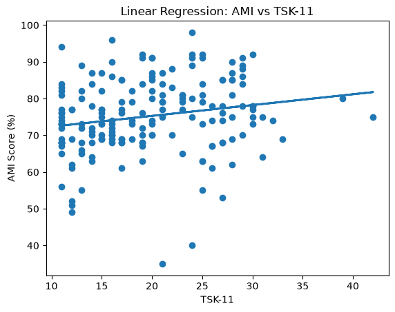

# ACL Rehabilitation Analysis: Investigating the Relationship Between AMI Scores and TSK-11 Outcomes

## Overview

This project investigates the relationship between Arthrogenic Muscle Inhibition (AMI) scores and Tampa Scale of Kinesiophobia (TSK-11) scores among patients recovering from anterior cruciate ligament (ACL) injuries.

Data were collected from patient rehabilitation records at Davis Physical Therapy and Sports Rehab. The original dataset included patients with a variety of injuries, including ankle, knee, hip, shoulder, and back conditions. For this analysis, only ACL injury observations were retained.

The project demonstrates a complete data science workflow, including data cleaning, exploratory analysis, longitudinal patient analysis, and regression modeling.

---

## Research Question

Is fear of movement, measured using the Tampa Scale of Kinesiophobia (TSK-11), associated with Arthrogenic Muscle Inhibition (AMI) scores in ACL rehabilitation patients?

---

## Dataset

### Source

* Davis Physical Therapy and Sports Rehab
* De-identified patient records
* Multiple observations collected throughout rehabilitation

### Variables

| Variable   | Description                        |
| ---------- | ---------------------------------- |
| patient_id | Anonymous patient identifier       |
| injury     | Injury type                        |
| date_ami   | Date of assessment                 |
| level      | Rehabilitation stage               |
| score_pct  | AMI score (%)                      |
| tsk_11     | Tampa Scale of Kinesiophobia score |

### Sample

* 98 ACL patients
* 415 ACL observations
* 180 observations containing both AMI and TSK-11 measurements

---

## Data Cleaning

The raw dataset required several preprocessing steps:

* Removal of patient names and identifiers
* Conversion of dates into datetime format
* Conversion of AMI scores to numeric values
* Handling missing values
* Standardization of variables
* Creation of an ACL-only analysis dataset

Cleaning procedures are documented in:

`notebooks/01_cleaning.ipynb`

---

## Exploratory Analysis

Exploratory analysis examined:

* Distribution of AMI scores
* Distribution of TSK-11 scores
* Relationship between AMI and TSK-11

Key descriptive statistics:

* Mean AMI Score: 75.18%
* Mean TSK-11 Score: 19.61

Exploratory analysis is documented in:

`notebooks/02_exploratory_analysis.ipynb`

### AMI vs TSK-11


---

## Longitudinal Analysis

Many patients were assessed multiple times during rehabilitation.

Longitudinal analysis examined:

* Changes in AMI scores over time
* Changes in TSK-11 scores over time
* Individual patient recovery trajectories
* First-to-last visit change analysis

Results demonstrated substantial variability between patients and highlighted the importance of repeated measurements during rehabilitation.

Analysis is documented in:

`notebooks/03_longitudinal_analysis.ipynb`

### Example Patient Trajectory


---

## Regression Modeling

A simple linear regression model was used to evaluate whether TSK-11 scores could predict AMI scores.

The model showed a weak positive relationship between TSK-11 and AMI scores.

### Regression Results

* Pearson Correlation: **0.19**
* R²: **[INSERT YOUR ACTUAL VALUE]**
* Variance Explained: **[INSERT YOUR ACTUAL VALUE × 100]%**

These findings suggest that TSK-11 explains only a small portion of the variation observed in AMI scores.

Analysis is documented in:

`notebooks/04_regression_model.ipynb`

### Regression Model



---

## Repository Structure

```text
A4A/
│
├── data/
│   ├── raw/
│   └── processed/
│
├── notebooks/
│   ├── 01_cleaning.ipynb
│   ├── 02_exploratory_analysis.ipynb
│   ├── 03_longitudinal_analysis.ipynb
│   └── 04_regression_model.ipynb
│
├── figures/
│
├── README.md
├── requirements.txt
└── LICENSE
```

---

## Key Findings

* 98 ACL patients were included in the analysis.
* 180 observations contained both AMI and TSK-11 measurements.
* Average AMI score was approximately 75%.
* Average TSK-11 score was approximately 20.
* A weak positive correlation was observed between TSK-11 and AMI scores.
* Longitudinal analysis demonstrated substantial variability in patient recovery trajectories.
* TSK-11 explained only a small proportion of variation in AMI scores.

---

## Future Work

Potential extensions include:

* Mixed-effects longitudinal modeling
* Time-to-recovery analysis
* Additional psychological outcome measures
* Larger multi-clinic datasets
* Machine learning approaches for rehabilitation outcome prediction

```
```
